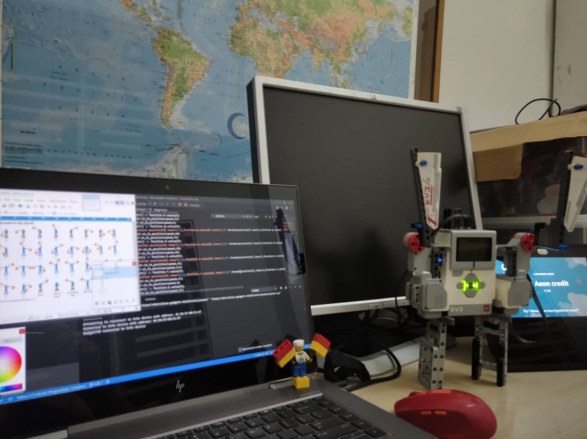

# yeoman
yeoman signal

Connection Diagram
ev3_yeoman.jpg 

  

Video showing operation

ev3_yeoman.mp4

to use
1) open yeoman signal
2) letter a OR letter alfa 
use you the letter you want as per table below
the second column is military alphabet

A=['a','alfa']
B=['b','bravo']
C=['c','charlie']
D=['d','delta']
E=['e','echo']
F=['f','foxtro']
G=['g','golf']
    H=['h','hotel']
    I=['i','india']
    J=['j','juliett']
    K=['k','kilo']
    L=['l','lima']
    M=['m','mike']
    N=['n','november']
    O=['o','oscar']
    P=['p','papa']
    Q=['q','quebec']
    R=['r','romeo']
    S=['s','sierra']
    T=['t','tango']
    U=['u','uniform']
    V=['v','victor']
    W=['w','whisky']
    X=['x','x-ray']
    Y=['y','yankee']
    Z=['z','zulu']
