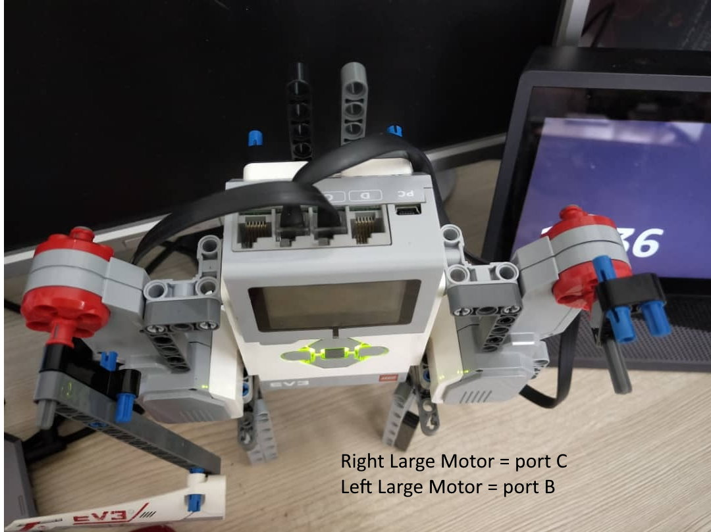

# yeoman
This is a LEGO Mindstorm EV3 with Amazon Alexa voice command trainer for flag semaphore
Flag Semaphore is telemetry system conveying information at a distance by means of visual signals with hand-held flags, rods, disks, paddles, or occasionally bare or gloved hands. Information is encoded by the position of the flags where it is read when the flag is in a fixed position. Semaphores were adopted and widely used in the maritime world in the 19th century. Despite modern alternative electronic communication means, flag semaphore is use a must learnt subject by all navies and mariners around the world.

## Connection Diagram
ev3_yeoman.jpg 

  

##### Video showing operation\

ev3_yeoman.mp4

## Instruction to use
1) open yeoman signal
2) letter a OR letter alfa 
use you the letter you want as per table below
the second column is military alphabet

A=['a','alfa']
B=['b','bravo']
C=['c','charlie']
D=['d','delta']
E=['e','echo']
F=['f','foxtro']
G=['g','golf']
H=['h','hotel']
I=['i','india']
J=['j','juliett']
K=['k','kilo']
L=['l','lima']
M=['m','mike']
N=['n','november']
O=['o','oscar']
P=['p','papa']
Q=['q','quebec']
R=['r','romeo']
S=['s','sierra']
T=['t','tango']
U=['u','uniform']
V=['v','victor']
W=['w','whisky']
X=['x','x-ray']
Y=['y','yankee']
Z=['z','zulu']
